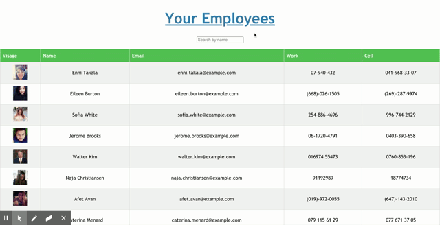

# React Employee Directory

Deployed at https://secure-hollows-70505.herokuapp.com/
# Description
This is an employee directory built in React.js which allows employers to view non-sensitive data about employees, sort the list alphabetically, and filter the list by search.
# Table of Contents
* [Installation](#Installation)
* [Usage](#Usage)
* [Contact](#Contact)
# Installation
Clone, npm i
# Usage
npm start
# Author
James Cook
# Contact

    
